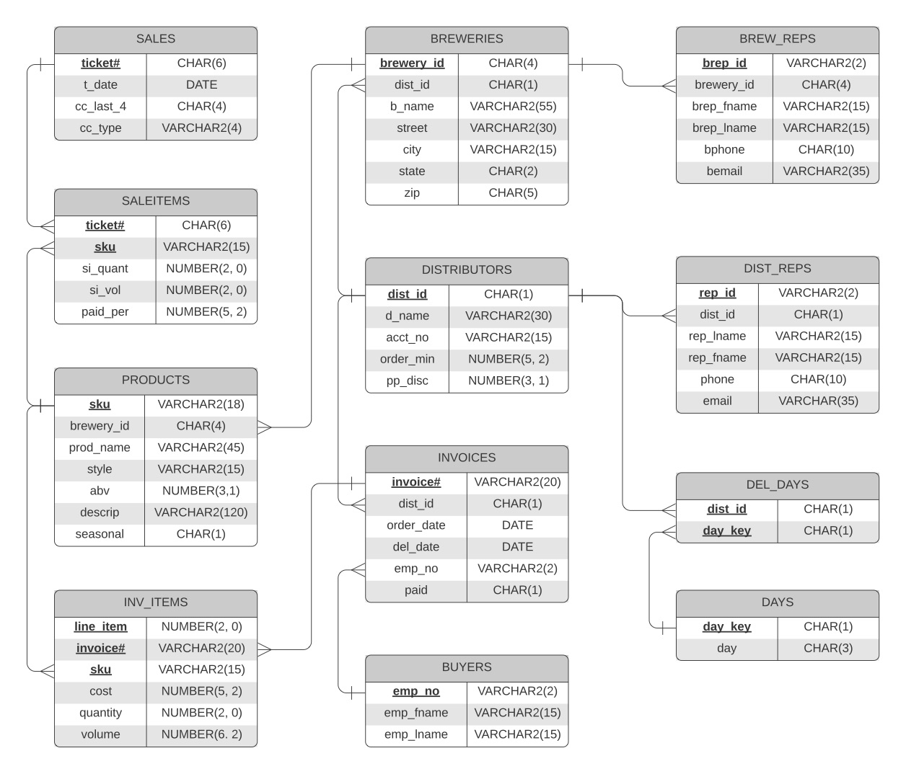

# Zymurgy Zone Business Database
## CSC236 SQL Programming Capstone Project

Completed during Summer 2021 semester at BHCC

### Project Description

The goal of this project is to display working knowledge of DDL, DML and DQL statements in Oracle 12c SQL. Students were to create a mock business database which conforms to 3NF normalization. This database is used to test execution of queries covering results restriction, joining tables, scalar and aggregate functions, and utilizing subqueries.

### Uses

- Oracle 12c SQL syntax
- Queryies and build script developed on Oracle Application Express web platform
- ERD created with [LucidChart](https://www.lucidchart.com/pages/)
- Presentation slides created with PowerPoint

### Fun Facts

I drew inspiration for this project from my experience as a Beverage Manager at a restaurant specializing in craft beer. The business names are ones that I worked with on a daily basis and most of the beers were our best selling product. So, this database is sort of a small snapshot into my day-to-day in that role. Zymurgy is one of my favorite words and I would sneak it into every write up I made for monthly pint nights. There's a definition in the slides.

